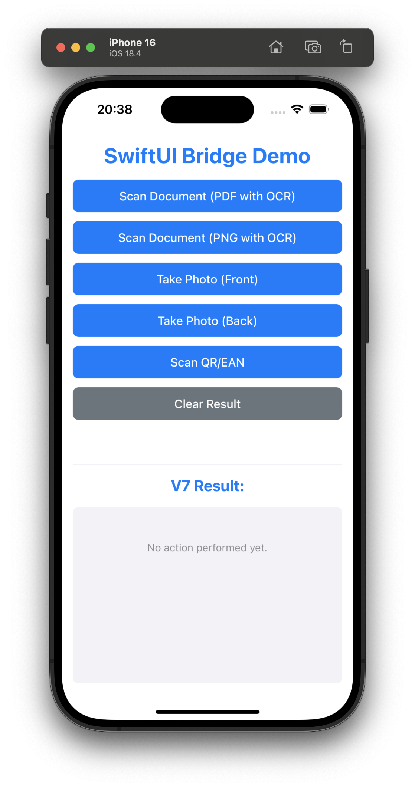

# swiftHTMLWebviewApp

**swiftHTMLWebviewApp** is an iOS app that provides a secure, customizable WebView container for running HTML/JavaScript-based applications with deep integration into native device features. It is designed for scenarios where you want to deliver a web-based UI but need access to device hardware (camera, barcode/document scanning, etc.) and secure configuration via QR codes.

---



---

## Features

- **Secure WebView**: Loads remote or local HTML/JS content in a sandboxed environment.
- **Native Integration**: Access device camera, scan documents, scan barcodes/QR codes, and generate PDFs.
- **Configurable via QR Code**: Change server URLs and security tokens by scanning a QR code.
- **Localized**: Multi-language support (English, German, French, Spanish, Japanese, Chinese).
- **Settings Bundle**: User-configurable server URL and security token.
- **JavaScript Bridge**: Communicate between JS and native Swift code for advanced workflows.

---

## Getting Started

### Prerequisites

- Xcode 15 or later
- iOS 17.6+ (Simulator or Device)
- Swift 5

### Build & Run

1. Clone this repository.
2. Open `swiftHTMLWebviewApp.xcodeproj` in Xcode.
3. Select the `swiftHTMLWebviewApp` scheme.
4. Build and run on a simulator or device.

### Configuration

- The app loads its main content from a server URL, which can be set in the app's settings or via QR code.
- Default server URL: `https://apps.ilass.com/swiftHTMLWebviewApp/`
- You can reset the server URL and security token in the iOS Settings app under the app's section.

---

## JavaScript Bridge Documentation

The app exposes a JavaScript bridge for communication between the loaded web content and the native app. The bridge is accessible via the `window.webkit.messageHandlers.swiftBridge` object.

### Sending Messages from JS to Native

Use the following pattern in your JavaScript code:

```js
window.webkit.messageHandlers.swiftBridge.postMessage({
  action: "scanDocument" | "takePhoto" | "scanBarcode",
  // ...additional parameters depending on action
});
```

#### Supported Actions

- **scanDocument**: Opens the document scanner. Returns scanned images (optionally with OCR text).
- **takePhoto**: Opens the camera. Returns a captured image.
- **scanBarcode**: Opens the barcode/QR scanner. Returns scanned code and format.

#### Example: Scan Document

```js
window.webkit.messageHandlers.swiftBridge.postMessage({
  action: "scanDocument",
  ocr: true, // optional: perform OCR
  outputType: "pdf" // or "png", "jpeg"
});
```

#### Example: Take Photo

```js
window.webkit.messageHandlers.swiftBridge.postMessage({
  action: "takePhoto",
  camera: "front" // or "rear"
});
```

#### Example: Scan Barcode

```js
window.webkit.messageHandlers.swiftBridge.postMessage({
  action: "scanBarcode",
  types: ["qr", "ean13"] // optional: restrict to certain barcode types
});
```

### Receiving Results in JS

The app will call a global JS function with the result:

```js
window.handleNativeResult = function(result) {
  // result: { action, images, pdfData, text, code, format, error, ... }
  // Handle the result or error
};
```

---

## QR Code Configuration

You can configure the app by scanning a QR code containing a JSON payload. This is useful for distributing server URLs and security tokens securely.

### QR Code JSON Format

```json
{
  "toolmode": "changeConfig",
  "defaultServerUrl": "https://your.server.url/",
  "securityToken": "YOUR_TOKEN"
}
```

- `toolmode` must be `"changeConfig"`
- `defaultServerUrl` is the new server URL to use
- `securityToken` is the new token (optional)

### Advanced: Change Security Token via QR Code

You can also use a QR code to change the security token directly by including the `newSecurityToken` field:

```json
{
  "toolmode": "changeConfig",
  "defaultServerUrl": "https://www.ilass.com/",
  "securityToken": "CHANGEmeASAP!",
  "newSecurityToken": "myNewToken"
}
```

- `newSecurityToken` will update the app's security token after scanning the QR code.

### Example QR Code Payload

```json
{
  "toolmode": "changeConfig",
  "defaultServerUrl": "https://apps.ilass.com/swiftHTMLWebviewApp/",
  "securityToken": "CHANGEmeASAP!"
}
```

Or, to change the security token:

```json
{
  "toolmode": "changeConfig",
  "defaultServerUrl": "https://www.ilass.com/",
  "securityToken": "CHANGEmeASAP!",
  "newSecurityToken": "sfdsfsdfsd"
}
```

You can generate a QR code from this JSON using any online QR code generator.

---

## Folder Structure

- `swiftHTMLWebviewApp/HTML/` — Local HTML, JS, and CSS files
- `swiftHTMLWebviewApp/Models/` — Swift models and settings
- `swiftHTMLWebviewApp/ScannerViews/` — Camera, document, and barcode scanner views
- `swiftHTMLWebviewApp/Utilities/` — Utility classes (PDF, image conversion, barcode utils, text recognition)
- `swiftHTMLWebviewApp/WebView/` — WebView integration
- `swiftHTMLWebviewApp/Assets.xcassets/` — App icons and images
- `swiftHTMLWebviewApp/Settings.bundle/` — iOS settings integration

---

## License

MIT License. See [LICENSE](LICENSE) for details.
