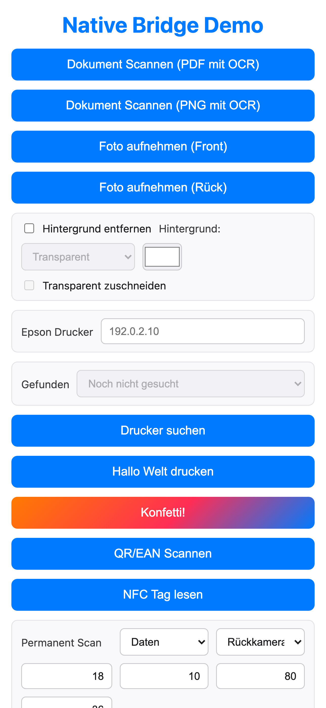

# swiftHTMLWebviewApp

`swiftHTMLWebviewApp` is a native WebView app wrapper for HTML/JavaScript
applications that need access to device features such as camera capture,
barcode scanning, document scanning, NFC, beacons, geolocation, sensors,
notifications, app-private storage, filesystem and SQLite persistence, AR,
RoomPlan, printing, confetti, and optional payment capabilities.

The project started as an iOS wrapper. The repository is now structured to support iOS and Android with a shared web-facing bridge contract.
Printer smoke tests share a small Go core that can be bound into both mobile platforms.



## Repository Layout

```text
swiftHTMLWebviewApp/
  ios/                         # iOS Xcode project
    swiftHTMLWebviewApp.xcodeproj
    swiftHTMLWebviewApp/
  android/                     # Android WebView wrapper
  docs/                        # Platform and bridge documentation
  examples/                    # Web examples for wrapper features
  media/                       # Screenshots and documentation assets
  printercore/                 # Shared Go printer core and CLI smoke test
```

## Features

### iOS

- Secure WebView container for remote or local HTML/JS content.
- Native camera/photo capture.
- Document scanning.
- QR/barcode scanning.
- NFC tag reading with NDEF record decoding.
- Embedded continuous QR/barcode scanning for web-app workflows.
- Continuous iBeacon ranging events using the configured Proximity UUID.
- Optional iBeacon advertising with configurable UUID, major, and minor values.
- Device information, settings, orientation, Wi-Fi, screenshot, sound, idle
  timer, geolocation, and sensor bridge actions.
- App-private persistence bridge actions for namespaced key/value storage,
  JSON or binary files, and SQLite databases.
- Optional kiosk reload control that web apps can show, hide, and configure.
  A tap reloads the WebView; a long press terminates the app for kiosk setups
  that relaunch it automatically.
- Screen streaming over WebSocket or NATS for diagnostics and remote viewing.
- Native NATS remote management with auto-connect, status/telemetry events,
  screenshots, QR image scan jobs, app-surface video frames, and reload/settings
  commands.
- ARKit local position stream.
- ARKit guided measurement with start-anchor confirmation, anchor capture,
  relocalization events, and position updates.
- Generic ARKit overlay/replay rendering with selectable items and lines.
- RoomPlan/LiDAR room scan, result, export, and world-map payloads.
- Native confetti burst from JavaScript.
- Local notifications with permission, immediate, scheduled, cancel, and open
  event bridge actions.
- QR-code based configuration for server URL and security token.
- Settings bundle for runtime configuration, including local/remote startup URL,
  optional high-availability fallback URLs, the iBeacon Proximity UUID, and
  deployment identity fields.
- BLE config pairing for nearby device setup through QR code or two-finger hold.
- Optional Stripe Terminal / Tap to Pay bridge.
- Optional Epson network-printer smoke test through the Go printer core.

### Android

Android support lives in `android/` as a native WebView wrapper with the same
web-facing bridge shape. The implementation includes the WebView container,
local smoke-test page, camera/scanner bridge features, NFC tag reading,
native portrait/pass-photo capture, beacons, Wi-Fi provisioning helpers,
geolocation, sensors, screen streaming, sound, idle timer, local notifications,
app-private storage, filesystem and SQLite persistence, kiosk reload control,
config pairing, structured unavailable responses for iOS-only AR/RoomPlan
actions, Sunmi internal printer payloads, and optional printer-core bindings for
Epson network-printer smoke tests.

## Getting Started: iOS

Prerequisites:

- Xcode 16 or later
- iOS 17.6+ for the base app
- A real iPhone for Tap to Pay tests

Open the project:

```sh
open ios/swiftHTMLWebviewApp.xcodeproj
```

Build the `swiftHTMLWebviewApp` scheme.

## JavaScript Bridge

Web content sends messages through WebKit:

```js
window.webkit.messageHandlers.swiftBridge.postMessage({
  action: 'scanBarcode',
  requestId: crypto.randomUUID()
});
```

Native code responds by calling:

```js
window.handleNativeResult = function(result) {
  console.log(result);
};
```

See [docs/native-bridge.md](docs/native-bridge.md) for the bridge contract.

## Built-In Bridge Actions

- Capture and scanning: `scanDocument`, `takePhoto`, `portraitCapture`,
  `scanBarcode`, `nfcTagRead`, `continuousScanStart`, `continuousScanStop`,
  `dataScanStart`, `dataScanEnd`, `loginScanStart`, `loginScanEnd`,
  `previewBoxLocationUpdate`.
- Beacon and proximity: `beaconsStart`, `beaconsStop`,
  `beaconAdvertiseStart`, `beaconAdvertiseStop`.
- Device and runtime settings: `deviceInfoGet`, `settingsGet`, `settingsSet`,
  `storageGet`, `storageSet`, `storageRemove`, `storageClear`,
  `filesystemWrite`, `filesystemRead`, `filesystemList`, `filesystemDelete`,
  `sqliteExecute`, `sqliteDeleteDatabase`, `kioskReloadControlSet`,
  `screenOrientationGet`, `screenOrientationSet`, `wifiStatusGet`,
  `wifiConfigure`, `screenshotGet`, `reload`.
- Location, sensors, and streaming: `geoLocationGet`, `geoLocationStart`,
  `geoLocationStop`, `sensorCapabilitiesGet`, `sensorStreamStart`,
  `sensorStreamStop`, `screenStreamStart`, `screenStreamStop`,
  `natsProvision`, `natsStatus`, `natsConnect`, `natsDisconnect`,
  `natsPublish`.
- ARKit and RoomPlan: `arPositionStart`, `arPositionStop`,
  `arGuidedMeasurementStart`, `arGuidedMeasurementSetAnchors`,
  `arGuidedMeasurementUpdateStats`, `arGuidedMeasurementStop`,
  `arOverlayOpen`, `arOverlayClose`, `arReplayOpen`, `arReplayClose`,
  `roomPlanScanStart`, `roomPlanScanStop`, `roomPlanScanExport`.
- Notifications and foreground behavior: `notificationPermissionGet`,
  `notificationPermissionRequest`, `notificationShow`, `notificationSchedule`,
  `notificationCancel`, `notificationCancelAll`, `notificationList`,
  `idleTimerStart`, `idleTimerReset`, `idleTimerStop`, `soundPlay`.
- External setup and pairing: `configPairingShow`, `configPairingStop`,
  `configPairingConnect`, `configPairingDisconnect`, `configPairingSend`, plus
  iOS persistent ESP discovery through `configDeviceScanStart`,
  `configDeviceConnect`, and `configDeviceSend`.
- Effects, payment, and printing: `launchConfetti`, `tapToPayAvailability`,
  `tapToPayCollect`, `printerDiscover`, `printerHelloWorld`, `printerPrint`,
  `printerEpsonHelloWorld`.

When provisioned, the wrapper also opens a native NATS connection on iOS and
Android, auto-connects on launch/resume, publishes redacted status/telemetry,
and listens on
`swift.wrapper.<appUUID>.commands.*` for the first remote management commands:
`status`, `settings`, `settingsSet`, `screenshot`, `qrScanImage` /
`qrScanJob`, `screenStreamStart`, `screenStreamStop`, `reload`, and
`natsStatus`. `tools/natscontrol` can watch NATS frames/events/replies and send
screen-stream or QR scan commands.

## Printer Core Smoke Test

The shared Go printer core can be tested before rebuilding the mobile apps:

```sh
cd printercore
go test ./...
go run ./cmd/pmprint -dry-run
go run ./cmd/pmprint -host <printer-ip>
```

The mobile demo page can call `printerDiscover` to scan the local IPv4 `/24`
network for Epson ePOS-Print endpoints and probable raw ESC/POS TCP printers.
On Android/Sunmi devices the native bridge adds the internal printer when the
Sunmi AIDL service is visible.

The generated mobile bindings are optional and ignored by git. A clean checkout
still builds without them; printer actions then return a structured unavailable
response except for Android/Sunmi internal printing.

Generate or refresh the Android AAR and iOS XCFramework when enabling the Go
printer core in a local app build:

```sh
printercore/scripts/build_mobile.sh
```

## Screen Stream Viewer

The demo screen-stream bridge sends app-screen JPEG frames over WebSocket. A
small Go viewer can receive the stream and show total bytes, throughput, FPS,
and the latest frame:

```sh
cd tools/screenstreamviewer
go run . -addr :18090
```

For NATS-based viewing and remote commands use:

```sh
cd tools/natscontrol
go run . watch -app APP-UUID -creds /path/to/admin.creds
go run . start -app APP-UUID -creds /path/to/admin.creds
go run . qr -app APP-UUID -creds /path/to/admin.creds -image ./qr.png
```

Open `http://<mac-ip>:18090/` in a browser and set the app demo page target to
`ws://<mac-ip>:18090/screen`.

`RUNNING_URLS.md` can be used locally to record current LAN/test URLs, but it is
ignored by git and should not be committed.

## Local Notifications

The core wrapper supports local OS notifications on iOS and Android. Web content
can request notification permission, show an immediate notification, schedule a
time-based notification, cancel pending/delivered notifications, and list
pending notifications. Notification opens are delivered back through
`window.handleNativeResult(...)` as `notificationOpened` events. Remote push is
not part of the default wrapper and should be added later as an optional module.

Android 12 and older do not have a runtime notification permission prompt, so
the bridge reports those devices as authorized immediately. Android immediate
alerts use a high-importance default channel (`swift_html_alerts`) so test
notifications can appear visibly instead of only playing a sound in the
notification shade.

## Optional Stripe Tap to Pay

Stripe/Tap-to-Pay support is included as optional source code.

Important behavior:

- The app builds without StripeTerminal linked.
- Without StripeTerminal, `tapToPayAvailability` returns `available: false`.
- When StripeTerminal is linked and Apple capabilities are configured, `tapToPayCollect` can start a native Tap to Pay flow.

See [docs/stripe-tap-to-pay.md](docs/stripe-tap-to-pay.md) for setup, entitlements, backend requirements, and JS payload examples.

## Private Product Variants

This repository should stay a reusable open-source wrapper. Product-specific
app names, bundle IDs, Android application IDs, icons, splash/loading assets,
startup URLs, signing references, store metadata, and release decisions belong
in the private product repositories.

The wrapper provides the shared bridge contract, optional native modules,
sanitized examples, and tooling for private native variants. From a private
product repository, the intended pre-Phase-4 flow is:

```sh
WRAPPER_ROOT=/path/to/swiftHTMLWebviewApp
node "$WRAPPER_ROOT/tools/variant_manifest_check.js" \
  --file native/variant.json
node "$WRAPPER_ROOT/tools/generate_variant_workspace.js" \
  --variant native/variant.json \
  --output native/generated
node "$WRAPPER_ROOT/tools/phase4_stop_gate_check.js" \
  --generated native/generated
```

Copy `native/generated/PHASE4_DECISION_RECORD_TEMPLATE.md` to a private-product-owned
path such as `native/phase4-migration-decision.md` before recording target
repository, CI, parity-test, or hardware-smoke evidence. Do not edit
`native/generated/` by hand. Before product data moves or wrapper cleanup
starts, run the stop-gate checker again with `--decision-record` and
`--require-filled-decision-record`.

## Platform Docs

Start with the bridge contract, then open the platform-specific notes for build,
capability, and deployment details:

- [Native bridge contract](docs/native-bridge.md)
- [iOS wrapper notes](docs/ios.md)
- [Android wrapper notes](docs/android.md)
- [Stripe Tap to Pay setup](docs/stripe-tap-to-pay.md)
- [Testing](docs/testing.md)
- [Wrapper variant architecture](docs/wrapper-variant-architecture.md)
- [Open-source wrapper migration plan](docs/open-source-wrapper-migration-plan.md)
- [Private product migration inventory](docs/private-product-migration-inventory.md)
- [Pre-Phase-4 readiness audit](docs/pre-phase4-readiness-audit.md)
- [Phase 4 private product migration brief](docs/phase4-private-product-migration-brief.md)
- [Phase 4 target repository candidates](docs/phase4-target-repo-candidates.md)
- [Private product footprint allowlist](docs/private-product-footprint-allowlist.json)
- [Private product native integration template](docs/private-product-native-integration-template.md)
- [Private variant manifest schema](docs/variant-manifest.schema.json)
- [Private variant manifest example](docs/variant-manifest.example.json)
- [Printer core README](printercore/README.md)
- [Screenstream viewer README](tools/screenstreamviewer/README.md)
- [Basic web example](examples/basic/README.md)
- [Stripe Tap to Pay web example](examples/stripe-tap-to-pay/README.md)

## Configuration via QR Code

The app can update its server URL, app-private configuration values, Wi-Fi
credentials, and security token by scanning a QR code containing JSON:

```json
{
  "toolmode": "changeConfig",
  "defaultServerUrl": "https://example.invalid/app/",
  "securityToken": "YOUR_TOKEN",
  "deviceName": "Demo Tablet 03",
  "deviceLocation": "Hall A / Entrance",
  "appConfig": {
    "siteKey": "Demo Site"
  },
  "wifi": {
    "ssid": "Demo WLAN",
    "password": "demo-password"
  }
}
```

The same values can be encoded as short URL/query parameters. Known setting
names update native settings. `store[...]` or `appConfig[...]` entries are
merged into the persistent `appConfig` object returned by `settingsGet`.
`wifi[...]` entries trigger `wifiConfigure` after the settings are stored:

```text
swifthtml-config://set?token=YOUR_TOKEN&serverURL=https%3A%2F%2Fexample.invalid%2Fapp%2F&store%5BsiteKey%5D=Demo%20Site&wifi%5Bssid%5D=Demo%20WLAN&wifi%5Bpw%5D=demo-password
```

The iOS Settings app also supports a local page mode (`local`), an optional
high-availability URL list (`ha_enabled`, `ha_timeout`, `ha_url2`, `ha_url3`,
`ha_url4`), an iBeacon Proximity UUID (`beacon_uuid`), and device identity
fields (`device_name`, `device_uuid`, `device_location`). `device_uuid` is
generated on first start if it is empty and can still be changed by authorized
configuration flows for station/terminal identity. `appUUID` is generated once
per native app installation and is returned read-only by `settingsGet`,
`deviceInfoGet`, and config-pairing identity payloads. The HA keys are kept
compatible with the existing legacy iOS naming so deployments can reuse the
same configuration model.

Optional token rotation:

```json
{
  "toolmode": "changeConfig",
  "defaultServerUrl": "https://example.invalid/app/",
  "securityToken": "CURRENT_TOKEN",
  "newSecurityToken": "NEW_TOKEN"
}
```

For external setup, `configPairingShow` displays a short-lived QR code and
starts a BLE GATT config session. Another device running the wrapper can scan
that QR, call `configPairingConnect`, then send `configPairingSend` commands
for status, URL/HA/beacon/device identity settings, WLAN setup, and reload. The
pairing QR includes the target `appUUID`, `deviceName`, `deviceUUID`, and
`deviceLocation`, but not the persistent security token. The same target UI opens
with a two-finger long press in the center of the WebView for about 1.5 seconds.
Large config commands and responses are chunked over BLE and reassembled by the
native bridge.
See [docs/native-bridge.md](docs/native-bridge.md).

## Design Principle

The wrapper exposes native capabilities. Product-specific logic should stay in the consuming web app and backend:

- Tenant/customer configuration
- Stripe account selection
- Payment/session state
- SMS/receipt workflows
- Business-specific screens

## License

See `LICENSE`.
