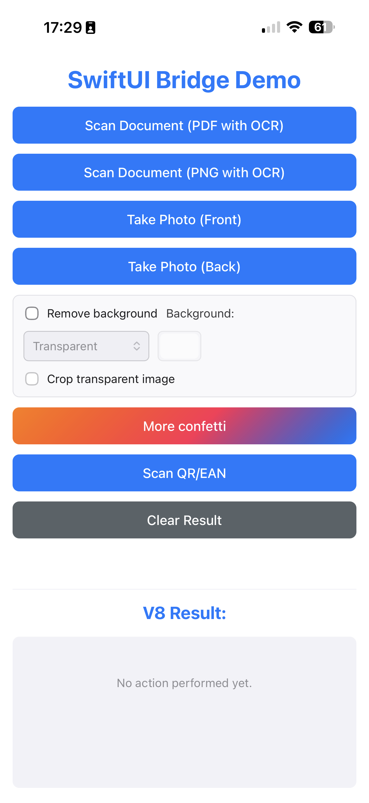

# swiftHTMLWebviewApp

`swiftHTMLWebviewApp` is a native WebView app wrapper for HTML/JavaScript applications that need access to device features such as camera, barcode scanning, document scanning, PDF generation, confetti, and optional payment capabilities.

The project started as an iOS wrapper. The repository is now structured to support iOS and Android with a shared web-facing bridge contract.



## Repository Layout

```text
swiftHTMLWebviewApp/
  ios/                         # iOS Xcode project
    swiftHTMLWebviewApp.xcodeproj
    swiftHTMLWebviewApp/
  android/                     # Android scaffold, implementation pending
  docs/                        # Platform and bridge documentation
  examples/                    # Web examples for wrapper features
  media/                       # Screenshots and documentation assets
```

## Features

### iOS

- Secure WebView container for remote or local HTML/JS content.
- Native camera/photo capture.
- Document scanning.
- QR/barcode scanning.
- PDF generation.
- Native confetti burst from JavaScript.
- QR-code based configuration for server URL and security token.
- Settings bundle for runtime configuration.
- Optional Stripe Terminal / Tap to Pay bridge.

### Android

Android support is scaffolded in `android/` but not implemented yet. The target is feature parity through the same JavaScript bridge API shape.

## Getting Started: iOS

Prerequisites:

- Xcode 15 or later
- iOS 17.6+ for the base app
- A real iPhone for Tap to Pay tests

Open the project:

```sh
open ios/swiftHTMLWebviewApp.xcodeproj
```

Build the `swiftHTMLWebviewApp` scheme.

## JavaScript Bridge

Web content sends messages through WebKit:

```js
window.webkit.messageHandlers.swiftBridge.postMessage({
  action: 'scanBarcode',
  requestId: crypto.randomUUID()
});
```

Native code responds by calling:

```js
window.handleNativeResult = function(result) {
  console.log(result);
};
```

See `docs/native-bridge.md` for the bridge contract.

## Built-in Bridge Actions

- `scanDocument`
- `takePhoto`
- `scanBarcode`
- `launchConfetti`
- `tapToPayAvailability` (optional Stripe module)
- `tapToPayCollect` (optional Stripe module)

## Optional Stripe Tap to Pay

Stripe/Tap-to-Pay support is included as optional source code.

Important behavior:

- The app builds without StripeTerminal linked.
- Without StripeTerminal, `tapToPayAvailability` returns `available: false`.
- When StripeTerminal is linked and Apple capabilities are configured, `tapToPayCollect` can start a native Tap to Pay flow.

See `docs/stripe-tap-to-pay.md` for setup, entitlements, backend requirements, and JS payload examples.

## Platform Docs

- `docs/ios.md`
- `docs/android.md`
- `docs/native-bridge.md`
- `docs/stripe-tap-to-pay.md`

## Configuration via QR Code

The app can update its server URL and security token by scanning a QR code containing:

```json
{
  "toolmode": "changeConfig",
  "defaultServerUrl": "https://your.server.url/",
  "securityToken": "YOUR_TOKEN"
}
```

Optional token rotation:

```json
{
  "toolmode": "changeConfig",
  "defaultServerUrl": "https://your.server.url/",
  "securityToken": "CURRENT_TOKEN",
  "newSecurityToken": "NEW_TOKEN"
}
```

## Design Principle

The wrapper exposes native capabilities. Product-specific logic should stay in the consuming web app and backend:

- Tenant/customer configuration
- Stripe account selection
- Payment/session state
- SMS/receipt workflows
- Business-specific screens

## License

See `LICENSE`.
