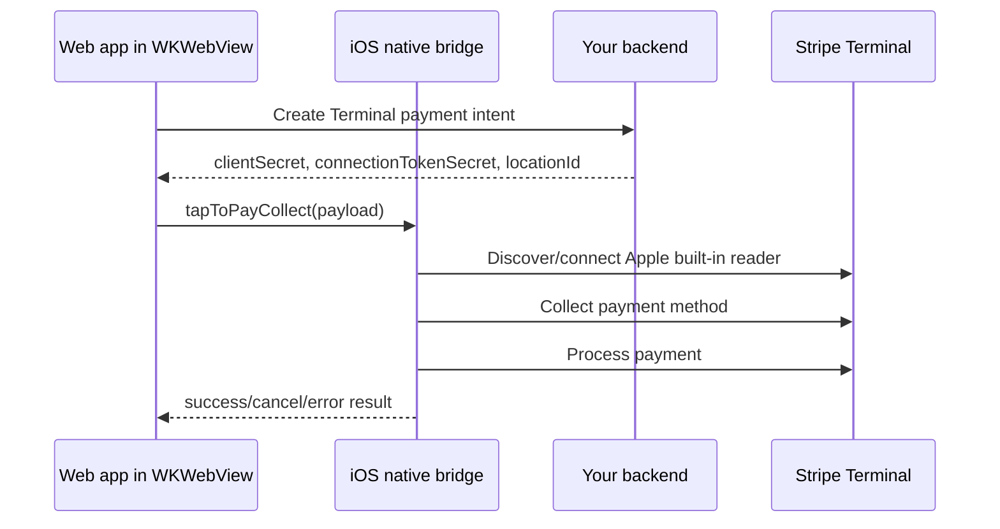

# Stripe Tap to Pay

Tap to Pay is an optional native capability. It is not required for a plain WebView build.

## Architecture



## iOS requirements

- Apple Developer capability: `Tap to Pay on iPhone`
- Apple Developer capability if needed by your flow: `Apple Pay Payment Processing`
- A real iPhone. Tap to Pay cannot be fully tested in simulator.
- Stripe Terminal SDK linked in the iOS Xcode project.
- Backend endpoint to create Stripe Terminal connection tokens.
- Backend endpoint to create PaymentIntents with card-present support.
- Stripe Terminal Location ID (`tml_...`). Model this per tenant, shop, or location as needed by your product.

## Adding StripeTerminal to iOS

Recommended: add the official Stripe Terminal iOS SDK to the Xcode project with Swift Package Manager.

Package URL:

```text
https://github.com/stripe/stripe-terminal-ios.git
```

Then link the `StripeTerminal` product to the app target.

The bridge file uses:

```swift
#if canImport(StripeTerminal)
import StripeTerminal
#endif
```

So builds without Stripe remain valid.

## Entitlements and Info.plist

Do not enable Tap to Pay by default in the generic wrapper unless your Apple team has the capability.

For an app that enables Tap to Pay, configure:

- `com.apple.developer.proximity-reader.payment.acceptance`
- Location usage description, required by Stripe Terminal flows
- Bluetooth usage descriptions if your Terminal integration also supports physical readers
- Background mode `bluetooth-central` only if required by your selected reader setup

Example Info.plist keys used by Stripe-capable apps:

```text
NSLocationWhenInUseUsageDescription
NSBluetoothAlwaysUsageDescription
NSBluetoothPeripheralUsageDescription
```

## JavaScript API

### Availability

```js
const requestId = crypto.randomUUID();
window.webkit.messageHandlers.swiftBridge.postMessage({
  action: 'tapToPayAvailability',
  requestId
});
```

Response:

```json
{
  "action": "tapToPayAvailability",
  "requestId": "...",
  "available": true,
  "readerType": "apple_built_in"
}
```

If StripeTerminal is not linked or the device cannot run Tap to Pay:

```json
{
  "action": "tapToPayAvailability",
  "requestId": "...",
  "available": false,
  "readerType": "apple_built_in",
  "reason": "..."
}
```

### Collect payment

```js
window.webkit.messageHandlers.swiftBridge.postMessage({
  action: 'tapToPayCollect',
  requestId: crypto.randomUUID(),
  paymentId: 'your-local-payment-id',
  clientSecret: 'pi_..._secret_...',
  connectionTokenSecret: 'pst_...',
  locationId: 'tml_...',
  merchantDisplayName: 'Your Business'
});
```

Success response:

```json
{
  "action": "tapToPayCollect",
  "requestId": "...",
  "paymentId": "your-local-payment-id",
  "paymentIntentId": "pi_...",
  "status": "succeeded",
  "nativeStatus": "processed"
}
```

Cancel response:

```json
{
  "action": "tapToPayCollect",
  "requestId": "...",
  "paymentId": "your-local-payment-id",
  "cancelled": true,
  "reason": "..."
}
```

Error response:

```json
{
  "action": "tapToPayCollect",
  "requestId": "...",
  "paymentId": "your-local-payment-id",
  "error": "..."
}
```

## Notes for products using the wrapper

Keep product-specific logic outside the wrapper:

- Tenant configuration
- Stripe account selection
- Terminal location assignment
- Backend payment/session state
- Receipt/SMS/webhook workflows

The wrapper should only expose native capabilities to the web app.
